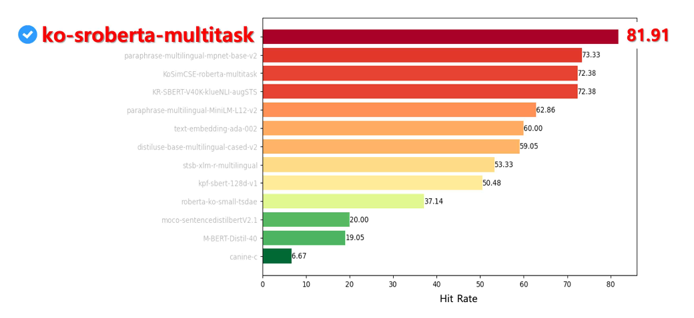

  <h1>"Korean-Embedding-Model-Performance-Benchmark-for-Retriever"</h1>
  
This is an experiment on search performance benchmarks after applying DAPT to Korean embedding models with various performances for the RAG system for a specific domain.

---  

## Ⅰ. 실험개요

### **1. 목표**
  > 특정 Domain에 관한 Retrieval-Augmented Generation (이하, RAG)를 수행하는데 있어 Embedding Model의 성능변화가 Domain Adaptation (이하 DAPT)적용 이후에 얼마나 유지가 되는지에 대한 실험을 수행하고자 함.

### **2. 배경**

- **기존 프로젝트의 후속실험으로 자세한 내용은 아래 항목을 참고할 것.**  
  - [SSiS TeamA - Ask-for-Welfare Service](https://github.com/ash-hun/Ask-for-Welfare)  
  - [SSiS TeamB - Advanced Semantic Search Engine](https://github.com/SSiS-TeamB/RAG)  
    
- **Domain Adaptation과 RAG**
  - 공통적으로 복지 도메인에 특화된 RAG System을 구축하고자 함.
   
  - 범용 Korean Embedding Model을 복지 도메인에 특화되게 DAPT 수행하였음.
    - 기존 프로젝트에서는 AVG Score가 가장 높은 `KoSimCSE-RoBERTa-multitask` 사용  

### **3. 내용**
- **기획**
   - 가설정의
     - 특정 Domain에 대해 RAG를 수행하는데 있어서, 임베딩 모델의 기본성능이 높을수록 DAPT를 수행했을 시 더 높은 Retriever 성능을 보일 것이다.
   - 데이터셋 생성 및 정제
     - [복지로](https://www.bokjiro.go.kr/ssis-tbu/index.do)에서 오픈소스로 공개된 `2023 나에게 힘이 되는 복지서비스` pdf 책자를 이용해 추가적인 데이터셋을 생성
   - 기존 프로젝트와 동일한 RAG System을 채용하였으며 Retriever이 잘 되는지 아닌지 평가하기 위해 hitrate를 평가지표로써 채택하였다.

- **환경구성**

      $ pip install -r requirement.txt

## Ⅱ. 실험내용

- [**👉 데이터셋 생성**](https://github.com/ssisOneTeam/Korean-Embedding-Model-Performance-Benchmark-for-Retriever/tree/main/QA_generator)
  - 비용산정
    - OpenAI API `gpt-4-1106-preview` 사용
    - 비용: 약 90.2$
    - [OpenAI API Pricing](https://openai.com/pricing) 참조
- [**👉 테스트 내용**](https://github.com/ash-hun/Korean-Embedding-Model-Performance-Benchmark-for-Retriever/tree/main/embeddingtest)

## Ⅲ. 실험결과 
  
 
| Model                                       | @1     | @3     | @5     | @10    | Average |
|---------------------------------------------|--------|--------|--------|--------|---------|
| paraphrase-multilingual-mpnet-base-v2-a     | 40.0   | 58.095 | 63.81  | 73.333 | 58.810  |
| paraphrase-multilingual-mpnet-base-v2-b     | 36.19  | 59.048 | 61.905 | 69.524 | 56.667  |
| paraphrase-multilingual-MiniLM-L12-v2-a     | 25.714 | 41.905 | 51.429 | 62.857 | 45.476  |
| paraphrase-multilingual-MiniLM-L12-v2-b     | 24.762 | 35.238 | 42.857 | 51.429 | 38.571  |
| distiluse-base-multilingual-cased-v2-a      | 24.762 | 39.048 | 47.619 | 59.048 | 42.619  |
| distiluse-base-multilingual-cased-v2-b      | 22.857 | 40.952 | 50.476 | 57.143 | 42.857  |
| stsb-xlm-r-multilingual-a                   | 20.952 | 33.333 | 41.905 | 53.333 | 37.381  |
| stsb-xlm-r-multilingual-b                   | 11.429 | 19.048 | 19.048 | 20.0   | 17.381  |
| ko-sroberta-multitask-a                     | 49.524 | 69.524 | 77.143 | 81.905 | 69.524  |
| ko-sroberta-multitask-b                     | 53.333 | 71.429 | 78.095 | 84.762 | 71.905  |
| KR-SBERT-V40K-klueNLI-augSTS-a              | 37.143 | 54.286 | 63.81  | 72.381 | 56.905  |
| KR-SBERT-V40K-klueNLI-augSTS-b              | 32.381 | 56.19  | 63.81  | 72.381 | 56.191  |
| moco-sentencedistilbertV2.1-a               | 7.619  | 11.429 | 11.429 | 20.0   | 12.619  |
| moco-sentencedistilbertV2.1-b               | 20.952 | 25.714 | 27.619 | 30.476 | 26.190  |
| kpf-sbert-128d-v1-a                         | 21.905 | 37.143 | 44.762 | 50.476 | 38.571  |
| kpf-sbert-128d-v1-b                         | 27.619 | 40.0   | 45.714 | 49.524 | 40.714  |
| M-BERT-Distil-40-a                          | 5.714  | 10.476 | 13.333 | 19.048 | 12.143  |
| M-BERT-Distil-40-b                          | 4.762  | 12.381 | 18.095 | 24.762 | 15.000  |
| canine-c-a                                  | 0.952  | 4.762  | 5.714  | 6.667  | 4.524   |
| canine-c-b                                  | 1.905  | 5.714  | 7.619  | 10.476 | 6.429   |
| roberta-ko-small-tsdae-a                    | 16.19  | 23.81  | 27.619 | 37.143 | 26.191  |
| roberta-ko-small-tsdae-b                    | 10.476 | 20.952 | 23.81  | 35.238 | 22.619  |
| KoSimCSE-roberta-multitask-a                | 37.143 | 58.095 | 63.81  | 72.381 | 57.857  |
| KoSimCSE-roberta-multitask-b                | 40.952 | 59.048 | 65.714 | 77.143 | 60.714  |
| text-embedding-ada-002-a                    | 41.905 | 47.619 | 57.143 | 60.0   | 51.667  |
| text-embedding-ada-002-b                    | 36.19  | 45.714 | 47.619 | 50.476 | 45.000  |

최종적으로 `ko-sroberta-multitask` 가 가장 높은 평균 수치를 가졌고 “특정 Domain에 대해 RAG를 수행하는데 있어서, 임베딩 모델의 기본성능이 높을수록 DAPT를 수행했을 시 더 높은 Retriever 성능을 보일 것이다.”라는 우리의 가정은 100% 틀린 것은 아니었다. 확인결과 Embedding Model의 성능이 높을수록 Domain Adaptation을 진행 후에도 전반적으로 높은 수치를 기록함을 알 수 있었다. **`즉, 가장 높은 성능의 임베딩 모델이 Adaptation 후에도 가장 높은 성능을 기록한다고 말할 수는 없어도 일반적인 경향성은 따라간다고 말할 수 있다.`**

## Ⅴ. 컨트리뷰터

<table align="center">
  <tr>
    <td align="center">
      <a href="https://github.com/PangPangGod">
         
        <b>송준호</b>
      </a>
    </td>
    <td align="center">
      <a href="https://github.com/ash-hun">
         
        <b>최재훈</b>
      </a>
    </td>
    <td align="center">
      <a href="https://github.com/MoonHeesun">
         
        <b>문희선</b>
      </a>
    </td>
    <td align="center">
      <a href="https://github.com/Noveled">
         
        <b>김민식</b>
      </a>
    </td>
    <td align="center">
      <a href="https://github.com/myeongjun1007">
         
        <b>현명준</b>
      </a>
    </td>
    <td align="center">
      <a href="https://github.com/kha-jaejun">
         
        <b>가재준</b>
      </a>
    </td>
  </tr>
</table>
